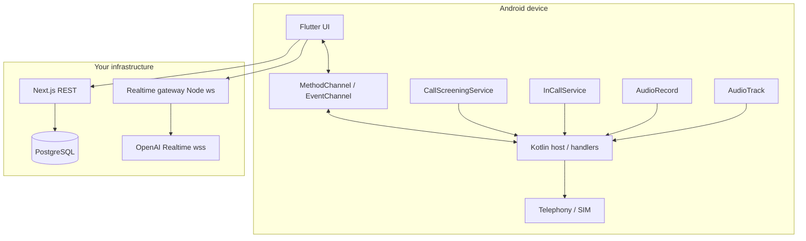

# AI Phone Assistant — Architecture

This repository implements an **Android-only** stack: **Flutter UI**, **Kotlin telephony/audio**, **Next.js API**, **PostgreSQL**, and a **standalone WebSocket gateway** for **OpenAI GPT‑4o Realtime** (no Supabase; **password + phone E.164** auth).

---

## High-level diagram

---

## Responsibilities by layer

| Layer | Role |
|--------|------|
| **Flutter** | Onboarding, splash, password auth UI, assistant/dial/logs/settings, **MethodChannel** commands (place call, roles, SIM snapshot), **EventChannel** stream for incoming/incall events, optional **WebSocket** to gateway for realtime audio control plane. |
| **Kotlin** | `TelecomManager`/`ACTION_CALL` for **real SIM outbound**; `CallScreeningService` for **incoming detection**; `InCallService` when app is **default dialer**; `AudioRecord`/`AudioTrack` skeleton for **PCM streaming** toward OpenAI. |
| **Next.js** | JWT auth, CRUD for profiles/contacts/calls; **never** exposes `OPENAI_API_KEY` to the mobile app. |
| **PostgreSQL** | Users, AI profiles, contacts, call logs (see `backend/sql/schema.sql`). |
| **Gateway (`npm run gateway`)** | Validates JWT from query string, opens upstream WebSocket to OpenAI, **byte-for-byte** forwards JSON/binary frames (session + audio events). |

---

## Call flow (target production behavior)

1. **Outbound**: Flutter calls native `placeCall` → `ACTION_CALL` → **user’s SIM** (requires `CALL_PHONE`).
2. **Inbound**: `CallScreeningService.onScreenCall` runs (requires **Call Screening role**). Kotlin emits `{ type: incoming, handle }` over **EventChannel**; Flutter shows **approval** dialog.
3. **Approval**: `onScreenCall` must return immediately; true “hold until user taps” needs **ConnectionService** / default dialer UX — document this limitation in code comments; current scaffold **allows ring** and captures consent for **AI audio bridge** in a later step.
4. **AI voice**: Mobile connects to **your gateway** with JWT; gateway connects to **OpenAI Realtime** with the API key; audio is PCM over Realtime events (wire `AudioStreamEngine` + Flutter codec helpers next).

---

## Security

- Passwords: **bcrypt** (cost 12) in Next.js.
- Tokens: **JWT** (30d) stored in **Flutter Secure Storage** on device.
- Realtime: **short-lived alternative** in production is OpenAI **ephemeral client secrets** minted by backend; this repo uses **JWT to your gateway** so the device never sees `OPENAI_API_KEY`.

---

## Configuration

### Backend (`backend/.env` or `.env.local`)

See `backend/.env.example`: `DATABASE_URL`, `JWT_SECRET`, `OPENAI_API_KEY`, `REALTIME_GATEWAY_PORT`, `OPENAI_REALTIME_MODEL`.

### Mobile (`--dart-define`)

Defaults target the **Android emulator** host loopback:

- `API_BASE` — default `http://10.0.2.2:3000`
- `REALTIME_URL` — default `ws://10.0.2.2:4000` (use `wss://…` for production, e.g. Render gateway)

Physical device: set to your PC’s LAN IP.

---

## Runbook

1. **Database**: create DB, run `backend/sql/schema.sql`.
2. **API**: `cd backend && npm install && npm run dev` (port 3000).
3. **Gateway**: `cd backend && npm run gateway` (port 4000).
4. **App**: `cd mobile && flutter run --dart-define=API_BASE=http://10.0.2.2:3000`

**OpenAI keys + Render hosting** (step-by-step): see [docs/OPENAI_AND_RENDER.md](docs/OPENAI_AND_RENDER.md).

---

## Key file map

| Area | Path |
|------|------|
| SQL schema | `backend/sql/schema.sql` |
| Auth & REST | `backend/src/app/api/**` |
| Realtime bridge | `backend/scripts/realtime-gateway.cjs` |
| Flutter entry | `mobile/lib/main.dart` |
| Theme | `mobile/lib/app_theme.dart` |
| Native channels | `mobile/android/.../MainActivity.kt`, `telecom/*` |
| Manifest / permissions | `mobile/android/app/src/main/AndroidManifest.xml` |

---

## Compliance & product notes

- **Default dialer** and **call screening** roles are **user-consented** system flows; surface clear copy in-app (onboarding already outlines this).
- **Phone number / call log** access is sensitive; ship a **privacy policy** and minimize retention before production.
- **OpenAI** usage must follow their terms; log **data processing** choices for enterprise customers.
